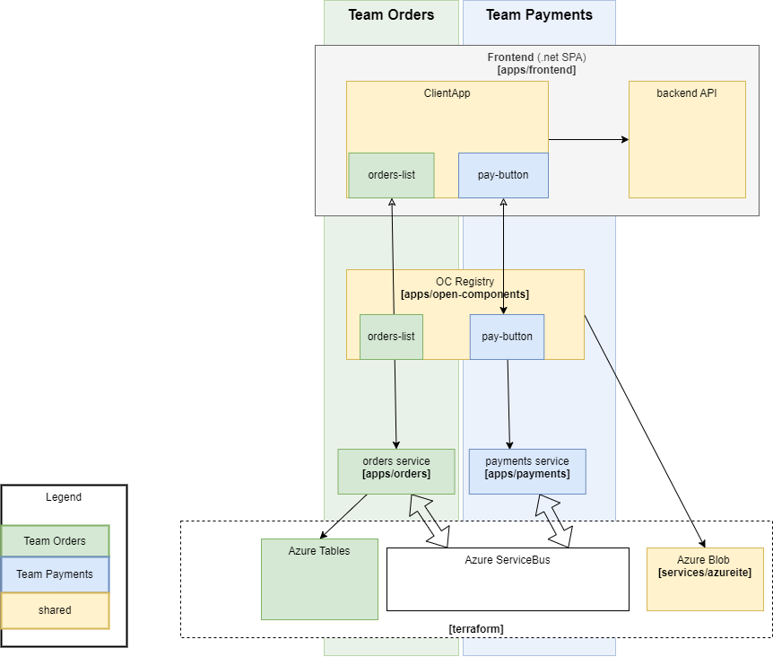

# Micro-Frontends template

This template contains an example of micro-frontends environment. It contains two microservices, each with it's own UI component that are then stiched together in a simple UI shell app. The solution uses [Open Components](https://opencomponents.github.io/) as an implementation of [micro-frontends](https://micro-frontends.org/) approach.

## Architecture

### Services

* `apps/`

## Running in Bunnyshell

1. Create your environment based on this template
2. You'll need an azure subscription for the infrastructure. Create a resource group `bunnyshell-rg` and a service principal that has "Contributor" access to that resource group. Set environment variables in bunnyshell (see [Azure Provider: Authenticating using a Service Principal with a Client Secret](https://registry.terraform.io/providers/hashicorp/azurerm/latest/docs/guides/service_principal_client_secret) for details):

    `ARM_CLIENT_ID` - client Id of the service principal
    `ARM_CLIENT_SECRET`: client secret
    `ARM_SUBSCRIPTION_ID`: your subscription Id
    `ARM_TENANT_ID`: your tenant Id

3. Set other secret variables:
   `oc_password`: password for publishing open components to the registry

## Running locally

### Prepare the infrastructure

The project depends on some azurerm resources. The naming schema includes bunnyshell unique environment id. For running locally, set terraform's `instance_suffix` to a unique value (by default it's `local`, which will work as long as you're the only one who modifies the infra).

1. `cd terraform`
2. `terraform init`
3. `terraform apply`

Once infrastructure is ready, you'll need connection strings, secrets, etc. configured in the apps. You can run `scripts/terraform-outputs.ps1` to get them distributed into right `.env` files.

### Run services

Each application in `apps` directory has it's own `docker-compose.yaml` file. You can run them separately or create one `docker-compose.yaml` to rule them all. To do this, use `scripts/recompose.ps1`. It will merge all separate docker-compose files along with `.env` files. Now you can simply run `docker compose up --build`.

### Local development

For local development, you can also start specific applications directly, without using docker. 
That would be `npm start` for node apps and `dotnet run` for .NET ones. The ports, configs, etc. are set up so that apps running in docker are interchangeable with their versions running "bare-metal".

## Testing

There's a very simple end-to-end test written in cypress that checks if everything works correctly. To run it:

1. `cd e2e`
2. `npm ci`
3. `npm test` (or `npm run cypress:open` to open the UI)

This will run against local services by default. To test a remote deployment, set `CYPRESS_BASE_URL` env variable to the  base url of your deployment (i.e. `https://main-abc123.bunnyenv.com/`).